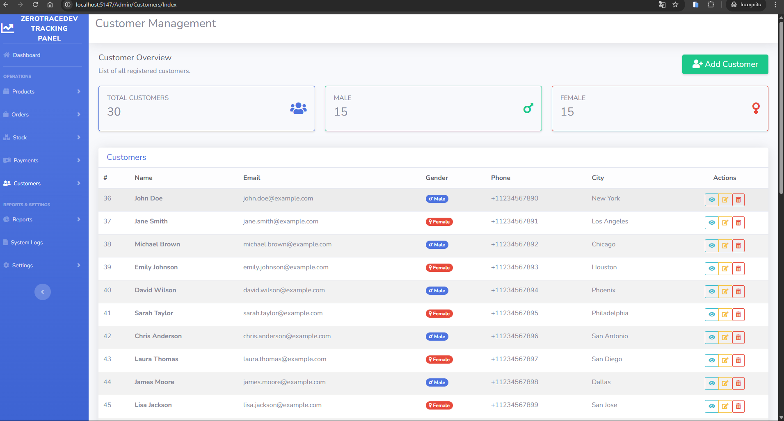

# 🚀 TrackingPanel

**Enterprise Management Panel Solution**  
Manage your customers, products, inventory, orders, and payments from a single, modern web platform. TrackingPanel combines a user-friendly interface with a robust backend architecture to optimize your business operations.

---

## 🖥️ Technologies Used

- **ASP.NET Core MVC**
- **Entity Framework Core**
- **SQL Server**

---

## 📖 About the Project

**TrackingPanel** is a professional management panel designed to streamline and digitalize processes such as customer, product, inventory, order, and payment management for businesses. With its intuitive dashboard and comprehensive analytics, you can monitor all your operations from a single point.

**Key Features:**
- Centralized customer, product, inventory, order, and payment management
- Real-time statistics and rich dashboard visualizations
- Role-based authorization and security infrastructure
- Easy setup: Database schema is created automatically via EF Core migrations (no manual SQL scripts required)
- Modern, responsive UI

---

## 📂 Project Structure

```
ZeroTraceTrackingPanel/
├─ MyMvcApp/                # Application source code
│  ├─ Controllers/          # Controller classes
│  ├─ Data/                 # DbContext and data access layer
│  ├─ Migrations/           # EF Core migration files (REQUIRED)
│  ├─ Models/               # Data models
│  ├─ Views/                # Razor view files
│  ├─ wwwroot/              # Static files (CSS, JS, images)
│  └─ ...                   # Other project files
├─ TrackingPanelScreenshot/ # UI screenshots
└─ ...
```

> **Note:**  
> - All application code is located in the `MyMvcApp` folder.  
> - Project screenshots are available in the `TrackingPanelScreenshot` directory.  
> - **Database setup requires the `Migrations` folder.**  
>   Do not delete migration files; otherwise, the database cannot be automatically created.

---

## 🖼️ Screenshots

| Dashboard | Customer Management | Order Management | Inventory | Products | Login & Signup |
|-----------|--------------------|------------------|-----------|----------|---------------|
|  |  |  |  |  |  |

---

## ⚡ Installation & Setup

### 1. Clone the Repository
```bash
git clone https://github.com/[YOUR_GITHUB_USERNAME]/ZeroTraceTrackingPanel.git
cd ZeroTraceTrackingPanel/MyMvcApp
```

### 2. Restore Dependencies
```bash
dotnet restore
```

### 3. **Create the Database via Migration**
> **Attention:**  
> The `Migrations` folder is **required** for initial database setup. Do **not** delete migration files!

```bash
dotnet ef database update
```
> This command will automatically create the database schema using the included EF Core migration files. No manual SQL scripts are needed.

### 4. Run the Application
```bash
dotnet run
```

### 5. Access the Application in Your Browser
```
http://localhost:5000
```

---

## 🛠️ Roadmap & Ongoing Development

TrackingPanel is still under active development and new features are being added. Planned enhancements include:

- [ ] User pages
- [ ] Password hashing for security
- [ ] Reporting module
- [ ] System logs and audit screens
- [ ] Admin settings page
- [ ] Advanced role-based authorization

---

## 📄 License

MIT License  
© ZeroTrace

---

## 💡 Contribution & Contact

Feel free to open a PR or create an Issue for any suggestions, feedback, or contributions.

**Contact:**  
[Your GitHub Profile](https://github.com/zerotracedev)

---
**_TrackingPanel is an actively maintained project. Stay tuned for regular updates and new features!_**
